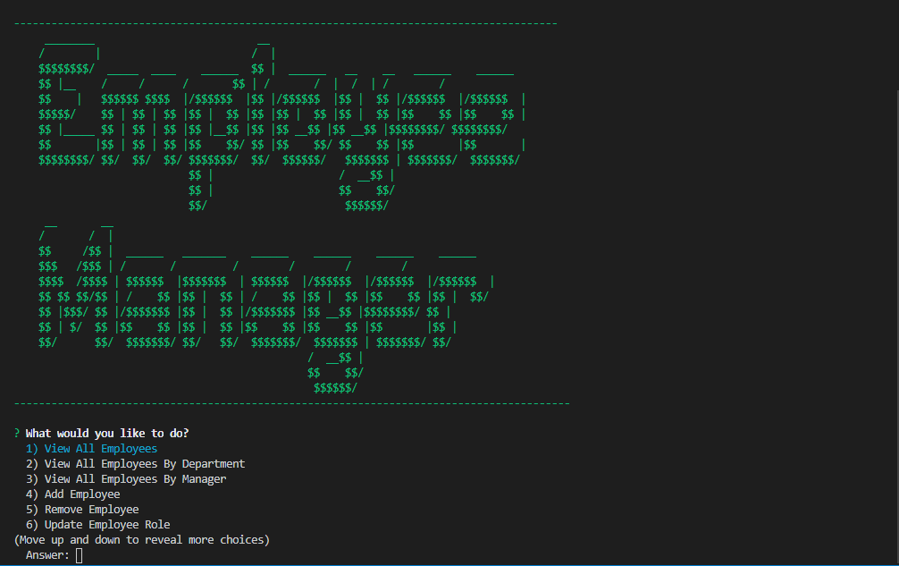
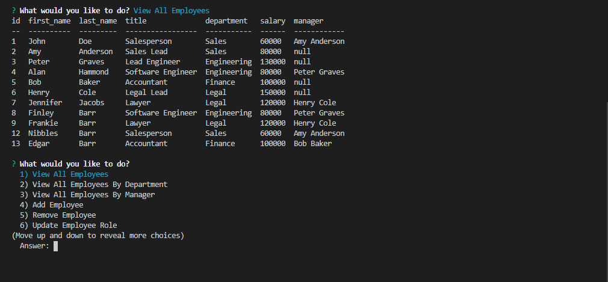
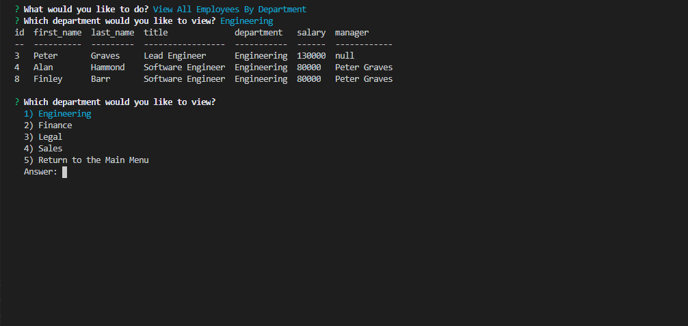
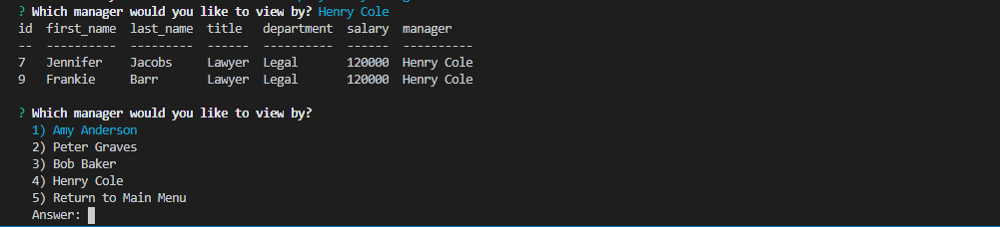
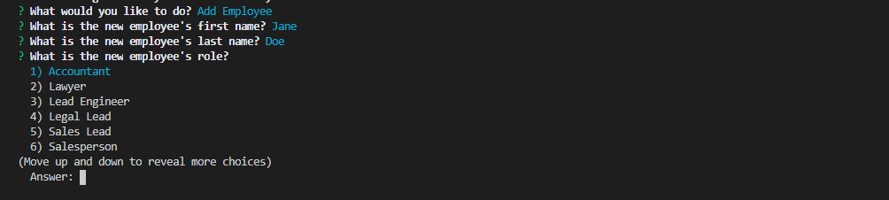
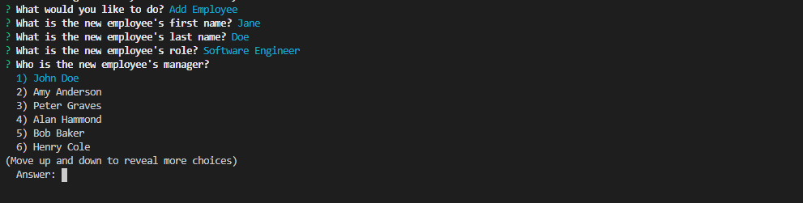
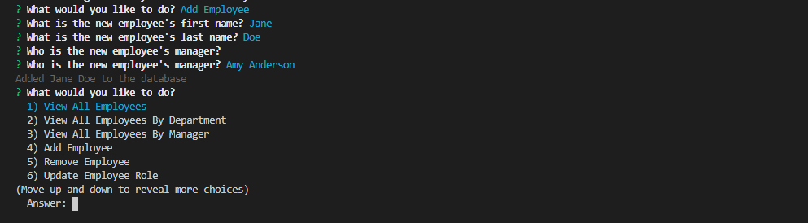

# Employee Tracker


## Table of Contents

1. [Description](#Description)
2. [Languages and Technologies Used](#Languages-and-Technologies-Used)
3. [Installation](#Installation)
4. [Usage](#Usage)
5. [Walk thru Video](#Walk-thru-Video)
6. [Screencaps](#Screencaps)
7. [Questions](#Questions)
<br/>
<br/>

## Description

The Employee Tracker app allows a user to view and manage employees.  The user can view all employees, view employees by department, view employees by manager, add a new employee, remove an employee, update an employee's role, and update an employee's manager.  
<br/>
<br/>

## Languages and Technologies Used

* JavaScript
* Node.js
* MySQL

The Node.js app uses the CLI (Command Line Interface) to prompt the user with the inquirer module to choose the action the user wishes to complete.  Using the mysql module, the app interacts with the MySQL database by performing queries and returning the data from the database.  The data is then logged to the console using the console.table module.


<br/>
<br/>

## Installation

1. Clone the [repository](https://github.com/BrienBarr/Employee-Tracker) to your PC.
2. Open the local directory to where you cloned the repository in the command line/terminal.
3. Run the npm i command from the command line/terminal.
```
npm i
```
<br/>
<br/>

## Usage

Use the "npm start" or "node server.js" commands from the command-line/terminal to start the server connection.
```
npm start
```
OR
```
node server.js
```

<br/>
<br/>

## Walk thru Video
[See a demonstration of the project in this video](https://drive.google.com/file/d/11FHlIhJb8zMsYiCEu_5qhHVl6CT-QyV8/view)

<br/>
<br/>

## Screencaps

<br/>
The start of the app<br/><br/>



<br/>
View all employees<br/><br/>



<br/>
View by department<br/><br/>



<br/>
View by manager<br/><br/>



<br/>
Add an employee<br/><br/>


<br/>

<br/>

<br/>

<br/>
<br/>

## Questions

[GitHub/BrienBarr](https://github.com/BrienBarr)<br/>
For additional questions, e-mail me at: [brien.barr3320@gmail.com](mailto:brien.barr3320@gmail.com)
